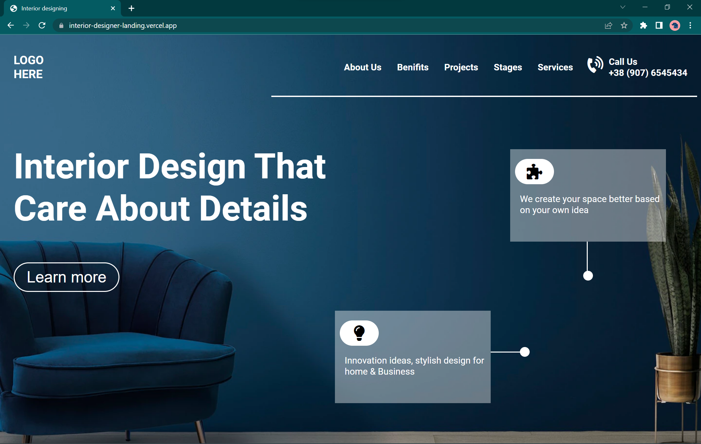
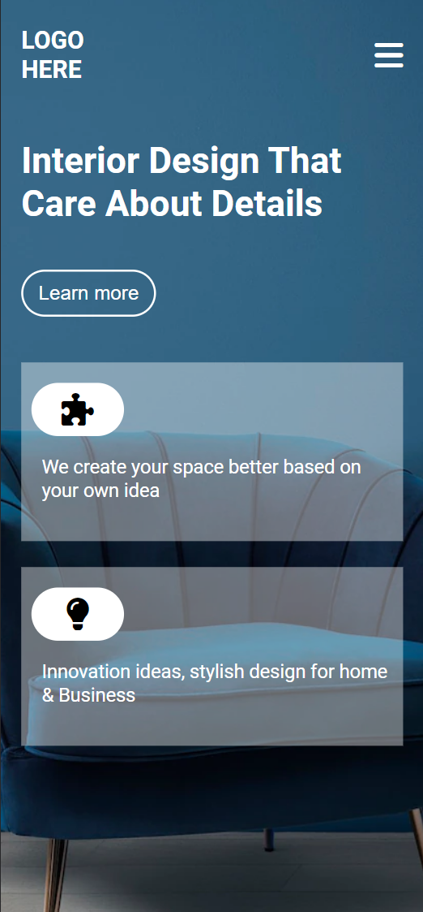

# Inerior Desiner Landing Page

> ## [Prateek Budhiraja](https://prateekbudhiraja.in)
>
>  

## Images

### Checkout the live website [here](https://interior-designer-landing.vercel.app/).

## My Learnings

- Learned and implemented media queries.
- Learned and implemented mobile first design.
- Learned how to provide the box background and given it to two boxes.
- Fixed the issue of fa icons not accepting custom CSS.
